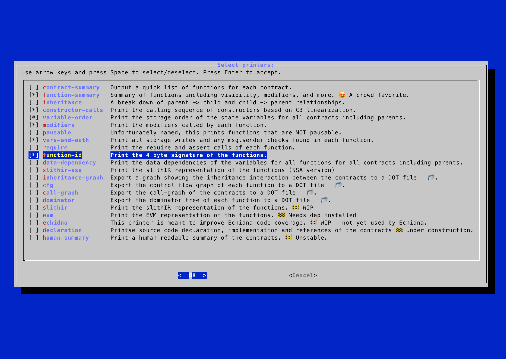

# slither-menus


### Features:

 - Text-based user interface for selecting [Slither](https://github.com/crytic/slither) options
 - Redirects Slither output to a log file
 - Useful for selecting Slither printers

## Prerequisitess

1. Install [Slither](https://github.com/crytic/slither#how-to-install).
2. Install `dialog`

Mac users brew install dialog
```bash
brew install dialog
```

Linux users apt install dialog
```bash
sudo apt install dialog
```

>**Warning**
>Slither needs to be running the same version of `solc` as specified in the pragma of the contracts being analyzed.  To easily install and switch between solc versions use [solc-select](https://github.com/crytic/solc-select).

## Installation


Clone this repo:
```bash
git clone git@github.com:devtooligan/slither-menus.git
```


## Usage

Before running this command from the project root directory, ensure your `solc` version matches `demo/test.sol`.  Change your `solc` version or update the `test.sol` file to run this demo.
```bash
bash ./src/slither_menus.sh ./demo/test.sol # optionally add log file dest
```

Menu with hints


Results logged

